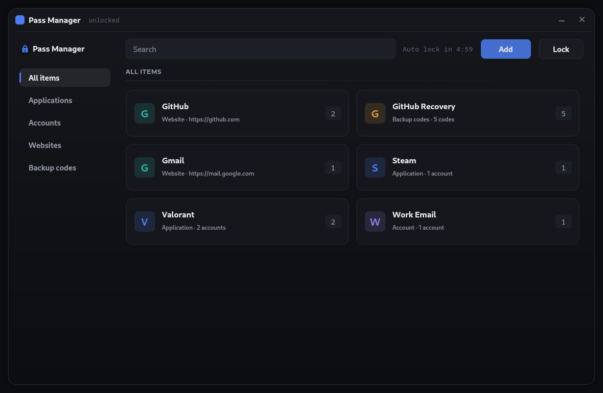
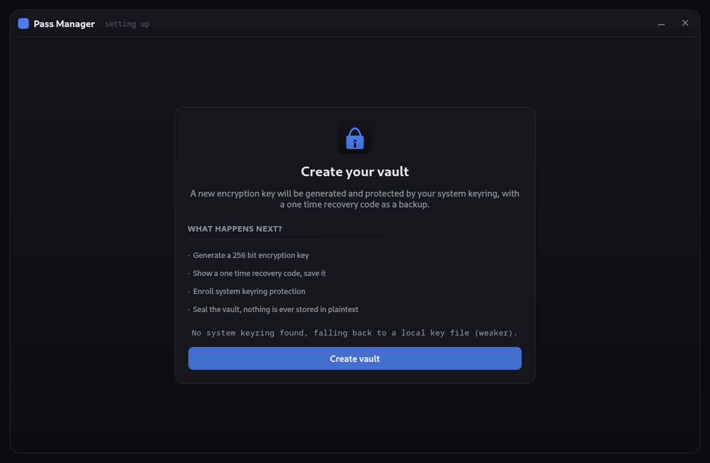
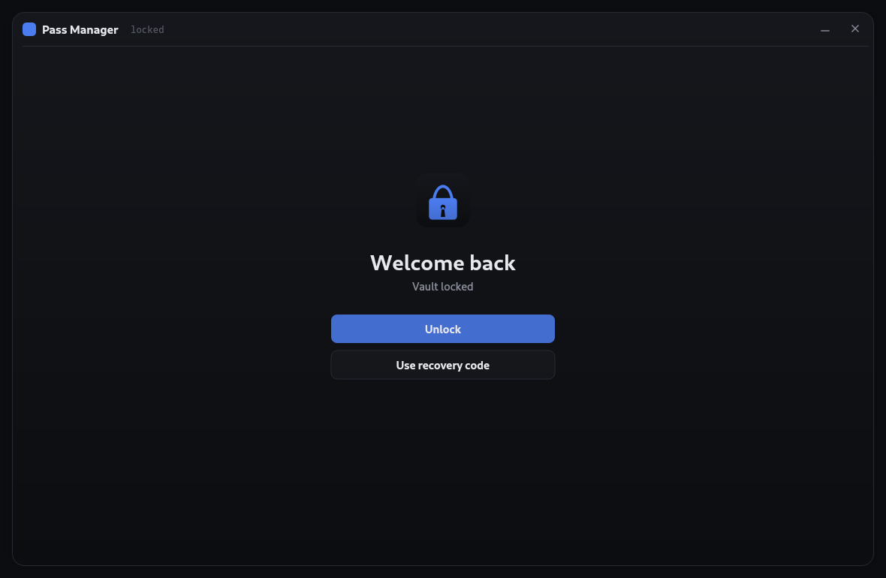
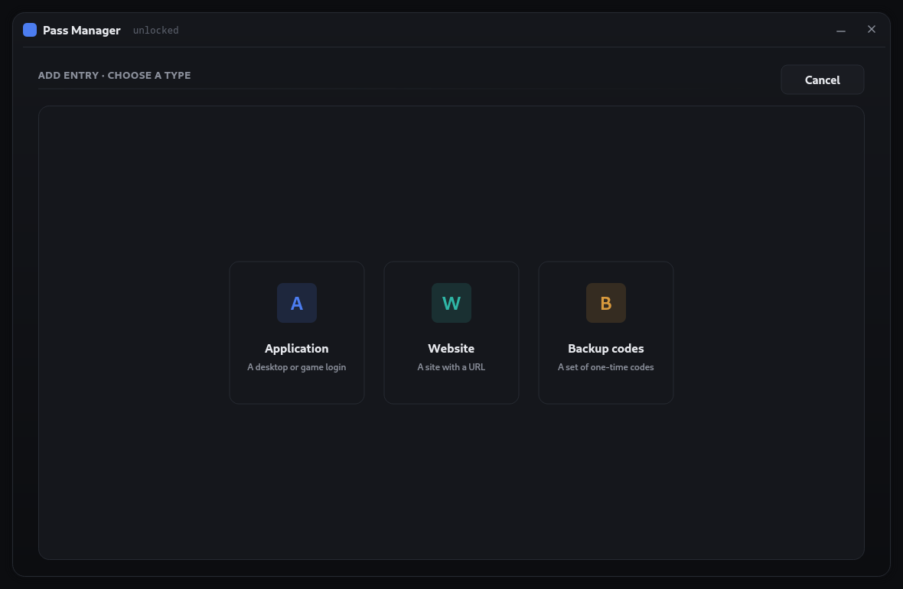
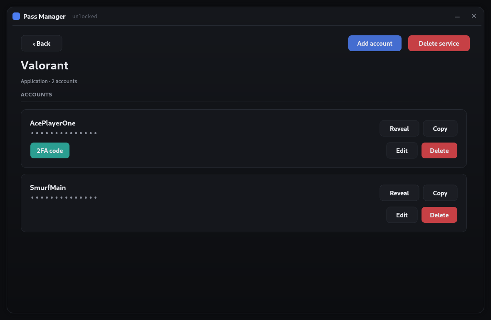

# Pass Manager

A local, self-hosted password manager. No cloud, no account, no telemetry —
your passwords, backup codes, and secrets live in one encrypted file on your
own machine, and nowhere else.

Pass Manager stores logins, one-time backup codes, and TOTP (2FA) seeds, and
can generate long, high-entropy passwords on demand. Everything is sealed
behind envelope encryption before it ever touches disk: even someone with a
full copy of your vault files gets nothing usable without either your system
keyring unlock or your one-time recovery code.



## Why

Most password managers ask you to trust a company's server with your vault.
Pass Manager doesn't have a server — the app *is* the vault. You keep the
folder, you keep the keys (by way of your OS keyring), and there's no account
to create, breach, or lose access to.

## Features

- **Applications, websites, general accounts, and one time backup codes** —
  organized by service, with multiple accounts per service where you need it
  (work email, alt accounts, etc).
- **Password generator** — 12 to 64 characters, guarantees a mix of
  character classes, shows a live strength meter and entropy estimate. Or
  skip it and type your own — either way it's sealed the same.
- **TOTP / 2FA codes** — store the seed once, get rolling 6-digit codes with
  a visible countdown, no separate authenticator app required.
- **Auto-locking** — the vault locks itself after 5 minutes idle, on demand
  with one click, and copied passwords clear from your clipboard after 15
  seconds.
- **Search** across every service, account, and URL.

## Security

- **Envelope encryption.** Every entry is encrypted individually with
  AES-256-GCM under a random 256-bit key. That key is itself only ever
  stored wrapped (encrypted), never in the clear.
- **Two independent unlock paths.** Day to day, the wrapping key is released
  by your system keyring (GNOME Keyring / KWallet via the freedesktop Secret
  Service). If you ever lose access to that, a one-time recovery code
  (shown once, at setup) unlocks the vault through an Argon2id-derived key
  instead — memory-hard and resistant to brute-forcing even offline.
- **Nothing sensitive is ever written to disk unencrypted** — not the
  password, not the encryption key, not the recovery code. This is verified
  automatically (see `data/selftest.py`), not just claimed.
- **Local-only.** No network calls, no update pinger, no analytics. The app
  reads and writes exactly one folder on your machine.

The vault files themselves use plain, unlabeled filenames and hold nothing
but ciphertext — there's nothing on disk that would tell someone what the
files are for or how to open them without the app.

## Screenshots

| Setup | Unlock |
|---|---|
|  |  |

| Add an entry | Entry detail |
|---|---|
|  |  |

## Install

Requires Linux with a desktop environment (the keyring unlock uses the
freedesktop Secret Service API — GNOME Keyring or KWallet).

```bash
git clone <this-repo-url>
cd pass-manager
./install.sh
```

`install.sh` installs any missing system Python packages, installs the app's
Python dependencies for your user, and — after asking — adds Pass Manager to
your applications menu with its own icon, so it shows up like any other
installed app. Uninstalling is deleting the directory (and, if you added it,
the Start Menu entry via `./install.sh --uninstall-menu-entry`).

Prefer to do it by hand?

```bash
pip install --user -r requirements.txt
python3 main.py
```

or just run `./run.sh`, which does the same thing and launches the app.

## Verify it yourself

Don't take the security claims on faith — the test suite proves them:

```bash
python3 -m core.selftest   # crypto primitives, wrong-key = unrecoverable
python3 -m data.selftest   # full vault lifecycle + no-plaintext-on-disk check
```

## License

MIT — see [LICENSE](LICENSE).
